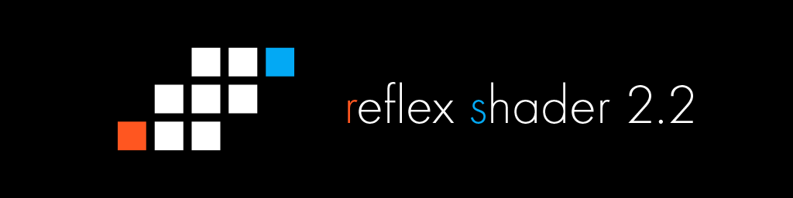

# Reflex Shader 2
This shader is made for VRChat.  
このシェーダーはVRChatにおいて利用されることを前提に開発されています。

Version 2.2.0

## Reflex Shader 2.2について
Reflex Shader 2.2はVRChat向けに開発されているアバター向けシェーダーです。  
特徴的な機能として以下のものがあります。
- オブジェクトからの影に対応
- 影色の自由な指定
- Matcapやリムライトなどのリッチな表現
- 色味や明るさはCubed's Unity Shaderに似ています
- 各機能にマスクを入れる場所を用意してあるので、一部のみ機能を有効化することができます。
- VRChatのSafety設定においてシェーダーが無効化されStandardになった場合もテクスチャが維持されます
- ScanlineやEmissive Scrollなどの発光系の機能が豊富なので、Sci-Fi系のアバターに適しています

## 導入方法
UnitypackageをUnityからインポートしてください。

## Shaders / シェーダー一覧
- Reflex Shader 2
  - Reflex Shader 2 (一般的な不透明のシェーダーです)
  - Reflex Shader 2 Cutout (透過部分を切り抜くシェーダーです)
  - Reflex Shader 2 Transparent (半透明のシェーダーです)
  - Stencil/Write (ステンシルで透過させる側のシェーダーです)
  - Stencil/Read (ステンシルで透過される側のシェーダーです) 
  - No Outline
    - Opaque (アウトラインなしの不透明シェーダーです)
    - Cutout (アウトラインなしのカットアウトシェーダーです)
    - Transparent (アウトラインなしの半透明シェーダーです)
    - Stencil/Write (アウトラインなしのステンシルで透過させる側のシェーダーです) 
    - Stencil/Read (アウトラインなしのステンシルで透過される側のシェーダーです) 

## Contact / 連絡先
Twitter : @reflex_1124  
VRChat : reflex1124